# SONiC SNMP Compliance Reference

> **Audience:** Medium-to-advanced network engineers and test engineers.  
> **Purpose:** Map what SONiC implements vs. what industry-standard NMS compliance requires across Entity MIB, Sensor MIB, Interface MIB, and Trap/Alarm subsystems, and provide a testing blueprint for pytest-based MIB validation.

---

## Table of Contents

1. [SONiC System Architecture](#1-sonic-system-architecture)
2. [SNMP Subsystem Deep Dive](#2-snmp-subsystem-deep-dive)
3. [SNMP Operations Primer](#3-snmp-operations-primer)
4. [Interface MIB — RFC 1213 / RFC 2863](#4-interface-mib--rfc-1213--rfc-2863)
5. [Entity MIB — RFC 2737](#5-entity-mib--rfc-2737)
6. [Entity Sensor MIB — RFC 3433](#6-entity-sensor-mib--rfc-3433)
7. [Alarms and Traps](#7-alarms-and-traps)
8. [Compliance Gap Summary](#8-compliance-gap-summary)
9. [External pytest Testing Blueprint](#9-external-pytest-testing-blueprint)

---

## 1. SONiC System Architecture

The diagram below shows every major SONiC container. **SNMP** and **mgmt-framework** are highlighted because they are the primary NMS-facing containers. Data plane containers are shown in green; control plane in blue; platform monitoring in teal; NMS/management in orange.

```mermaid
%%{init: {"theme": "base", "themeVariables": {"primaryColor": "#1a1a2e", "background": "#ffffff"}}}%%
graph TD
    classDef dataplane    fill:#1a6b1a,color:#fff,stroke:#0d4a0d,stroke-width:2px
    classDef controlplane fill:#1a3a6b,color:#fff,stroke:#0d2545,stroke-width:2px
    classDef platform     fill:#1a6b6b,color:#fff,stroke:#0d4545,stroke-width:2px
    classDef nms          fill:#b35c00,color:#fff,stroke:#7a3f00,stroke-width:3px,font-weight:bold
    classDef mgmtfw       fill:#6b0080,color:#fff,stroke:#4a0059,stroke-width:3px,font-weight:bold
    classDef db           fill:#555555,color:#fff,stroke:#333333,stroke-width:2px
    classDef host         fill:#333366,color:#fff,stroke:#222244,stroke-width:2px

    subgraph HOST["Host OS (Linux / Debian)"]
        KERNEL["Kernel / netdev / switchdev"]:::host
        SYSFS["sysfs / hwmon / i2c"]:::host
    end

    subgraph REDIS["Redis (docker-database)"]
        APPL_DB["APPL_DB (id=0)"]:::db
        ASIC_DB["ASIC_DB (id=1)"]:::db
        COUNTERS_DB["COUNTERS_DB (id=2)"]:::db
        CONFIG_DB["CONFIG_DB (id=4)"]:::db
        STATE_DB["STATE_DB (id=6)"]:::db
        SNMP_OVL["SNMP_OVERLAY_DB (id=7)"]:::db
    end

    subgraph DP["Data Plane"]
        SYNCD["syncd\n(SAI ↔ ASIC driver)"]:::dataplane
        SAI["SAI / ASIC SDK"]:::dataplane
    end

    subgraph CP["Control Plane"]
        SWSS["swss\n(orchagent, portsyncd,\nintfmgrd, vrfmgrd…)"]:::controlplane
        BGP["bgp (FRR)\nbgpd / ospfd / zebra\n-M snmp"]:::controlplane
        TEAMD["teamd\n(LAG / LACP)"]:::controlplane
        LLDPD["lldp\n(lldpd daemon)"]:::controlplane
        MACSEC["macsec"]:::controlplane
        NAT["nat"]:::controlplane
        DHCP["dhcp_relay"]:::controlplane
        RADV["radv\n(IPv6 RA)"]:::controlplane
    end

    subgraph PM["Platform Monitor"]
        PMON["pmon\n(platformd, thermalctld,\nledsyncd, psud, fand,\nsensord, xcvrd)"]:::platform
        GBSYNCD["gbsyncd\n(Chassis gearbox)"]:::platform
    end

    subgraph NMS["⭐ NMS / Management"]
        SNMP["🔶 docker-snmp\nsnmpd (master AgentX)\n+ sonic_ax_impl (Python subagent)\nUDP/161, AgentX tcp:3161"]:::nms
        MGMTFW["🔷 mgmt-framework\nREST API (gNMI / RESTCONF)\nCLI (SONiC-YANG)"]:::mgmtfw
        TELEMETRY["telemetry\n(gNMI streaming\nCounterDB tap)"]:::platform
        RESTAPI["restapi"]:::platform
    end

    %% Data flows
    KERNEL -->|"netlink / netdev"| SWSS
    SYSFS -->|"platform data"| PMON
    PMON -->|"FAN_INFO, PSU_INFO,\nTHERMAL_INFO, XCVR_*"| STATE_DB
    SWSS -->|"PORT_TABLE, LAG_TABLE,\nVLAN_TABLE"| APPL_DB
    SYNCD -->|"SAI object → OID map\nCOUNTERS_PORT_NAME_MAP"| COUNTERS_DB
    SYNCD <-->|"ASIC_DB (SAI ops)"| ASIC_DB
    BGP -->|"NEIGH_STATE_TABLE"| STATE_DB
    LLDPD -->|"LLDP_ENTRY_TABLE\nLLDP_LOC_CHASSIS"| STATE_DB
    TEAMD -->|"LAG_MEMBER_TABLE"| APPL_DB
    CONFIG_DB -->|"SNMP config\ndevice metadata"| SNMP
    APPL_DB -->|"interface tables"| SNMP
    STATE_DB -->|"sensor/entity/LLDP/BGP data"| SNMP
    COUNTERS_DB -->|"per-port 64-bit counters"| SNMP
    ASIC_DB -->|"bridge/VLAN OID map"| SNMP
    SNMP_OVL -->|"custom OID overlay"| SNMP
    CONFIG_DB --> MGMTFW
    STATE_DB --> MGMTFW
    STATE_DB --> TELEMETRY
    COUNTERS_DB --> TELEMETRY
```

### Key Container Roles

| Container | Primary Role | NMS Relevance |
|---|---|---|
| **docker-snmp** | Serves SNMP (UDP/161), runs net-snmp master + Python AgentX subagent | **Primary NMS target** |
| **mgmt-framework** | REST/gNMI northbound (OpenConfig / RESTCONF) | Alternative NMS interface |
| **telemetry** | gNMI streaming telemetry (CounterDB, StateDB taps) | Real-time streaming alternative |
| **swss** | Orchestrates ASIC state, populates APPL_DB & triggers syncd | Source of interface state |
| **syncd** | SAI ↔ ASIC driver bridge, populates COUNTERS_DB | Source of all counter data |
| **pmon** | Platform daemon — fans, PSUs, thermals, transceivers | Source of all sensor data |
| **bgp (FRR)** | Routing + BGP/OSPF SNMP subagent via `-M snmp` | Source of BGP MIB data |
| **lldp** | LLDP neighbor discovery | Source of LLDP MIB data |

---

## 2. SNMP Subsystem Deep Dive

### 2.1 Two-Layer AgentX Architecture

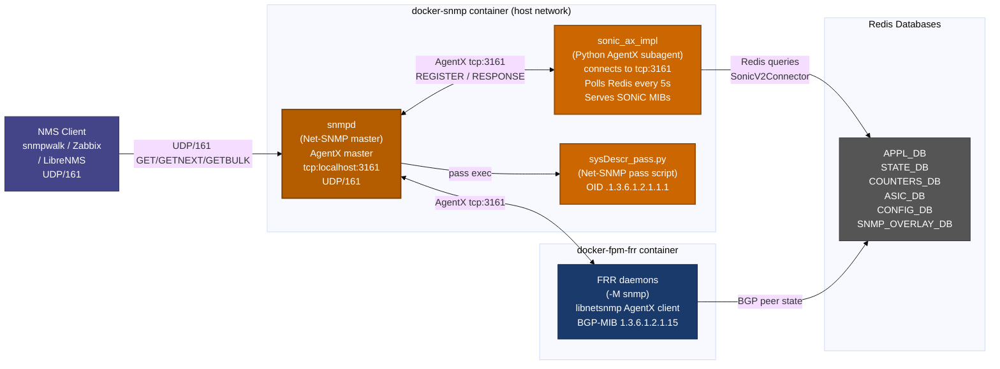

### 2.2 MIBs Served — Complete Map

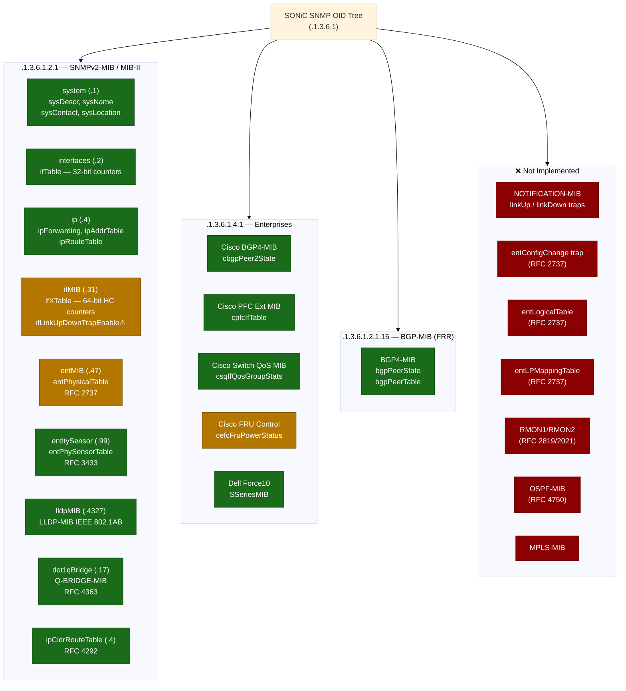

**Legend:** 🟢 Implemented &nbsp; 🟡 Partial / Placeholder &nbsp; 🔴 Not Implemented

---

## 3. SNMP Operations Primer

### 3.1 SNMP PDU Flow — GET / GETNEXT / GETBULK

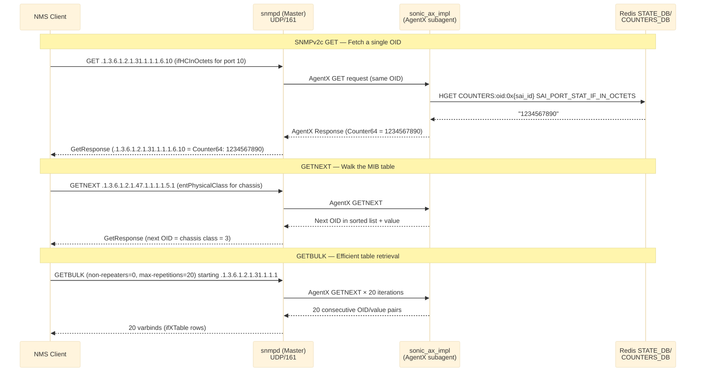

### 3.2 SNMP Trap / Notification Flow

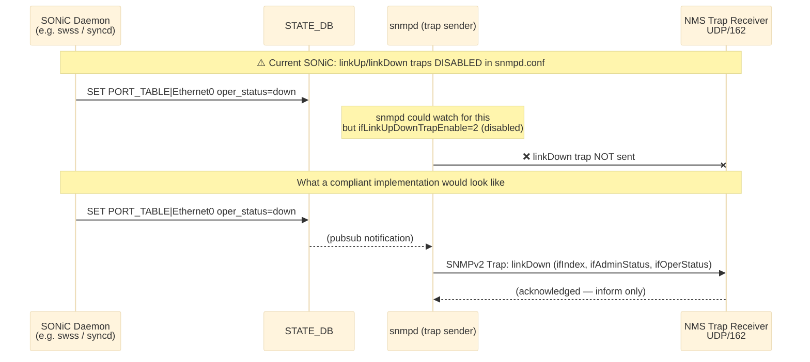

### 3.3 AgentX Registration Flow (Subagent Startup)

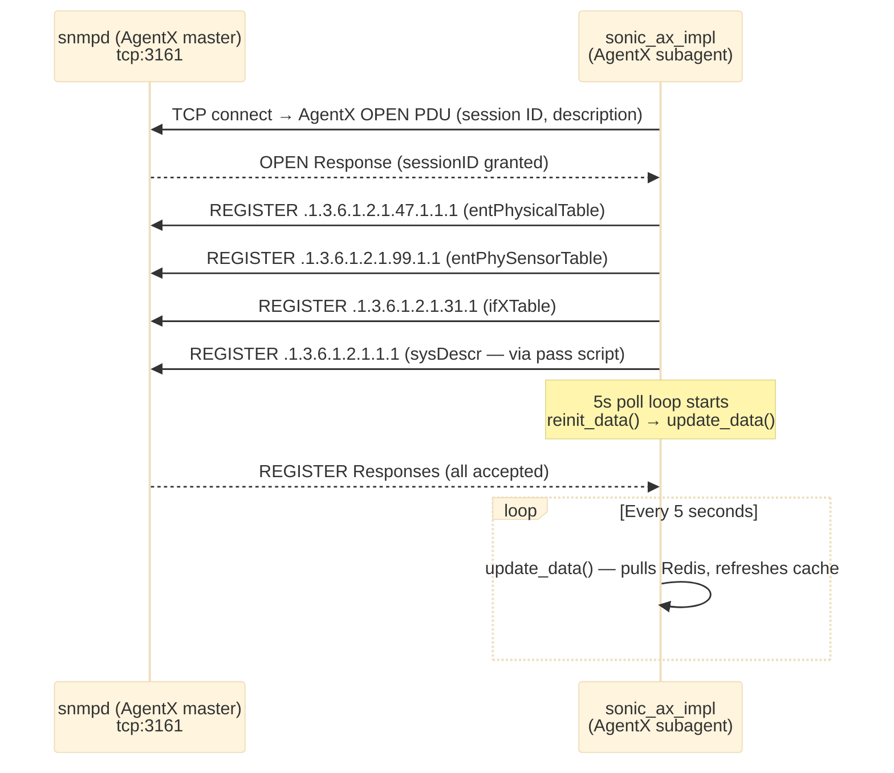

---

## 4. Interface MIB — RFC 1213 / RFC 2863

**OID Prefixes:**
- `ifTable` → `.1.3.6.1.2.1.2.2`
- `ifXTable` → `.1.3.6.1.2.1.31.1.1`

### 4.1 Data Source Map

```mermaid
%%{init: {"theme": "base"}}%%
graph LR
    classDef db     fill:#555555,color:#fff,stroke:#333333
    classDef mib    fill:#1a3a6b,color:#fff,stroke:#0d2545
    classDef impl   fill:#1a6b1a,color:#fff,stroke:#0d4a0d
    classDef miss   fill:#8b0000,color:#fff,stroke:#600000

    subgraph Sources["Redis Sources"]
        APPL["APPL_DB\nPORT_TABLE:Ethernet*\nLAG_TABLE:PortChannel*\nVLAN_TABLE:Vlan*"]:::db
        CFG["CONFIG_DB\nMGMT_PORT"]:::db
        CNT["COUNTERS_DB\nCOUNTERS:oid:0x...\nCOUNTERS_PORT_NAME_MAP"]:::db
    end

    subgraph IFTABLE["ifTable (.1.3.6.1.2.1.2.2.1)"]
        IFDESCR["ifDescr (.2) → interface alias"]:::impl
        IFTYPE["ifType (.3) → ethernetCsmacd(6)\nor propVirtual(53)"]:::impl
        IFMTU["ifMTU (.4) → from PORT_TABLE"]:::impl
        IFSPEED["ifSpeed (.5) → speed/1000 (32-bit, capped)"]:::impl
        IFPHYSADDR["ifPhysAddr (.6) → MAC address"]:::impl
        IFADMINSTATUS["ifAdminStatus (.7) → admin_status"]:::impl
        IFOPERSTATUS["ifOperStatus (.8) → oper_status"]:::impl
        IFLASTCHANGE["ifLastChange (.9) → ⚠️ returns 0"]:::miss
        IFINOCTETS["ifInOctets (.10) → Counter32 (truncated)"]:::impl
        IFINUCAST["ifInUcastPkts (.11)"]:::impl
        IFINERR["ifInErrors (.14)"]:::impl
        IFOUTOCTETS["ifOutOctets (.16) → Counter32"]:::impl
        IFOUTUCAST["ifOutUcastPkts (.17)"]:::impl
        IFOUTERR["ifOutErrors (.20)"]:::impl
    end

    subgraph IFXTABLE["ifXTable (.1.3.6.1.2.1.31.1.1.1)"]
        IFNAME["ifName (.1) → interface name"]:::impl
        IFINMCAST["ifInMulticastPkts (.2)"]:::impl
        IFINBCAST["ifInBroadcastPkts (.3)"]:::impl
        IFOUTMCAST["ifOutMulticastPkts (.4)"]:::impl
        IFOUTBCAST["ifOutBroadcastPkts (.5)"]:::impl
        IFHCINOCTETS["ifHCInOctets (.6) → Counter64 ✅"]:::impl
        IFHCINUCAST["ifHCInUcastPkts (.7) → Counter64 ✅"]:::impl
        IFHCINMCAST["ifHCInMulticastPkts (.8) → Counter64"]:::impl
        IFHCINBCAST["ifHCInBroadcastPkts (.9) → Counter64"]:::impl
        IFHCOUTOCTETS["ifHCOutOctets (.10) → Counter64 ✅"]:::impl
        IFHCOUTUCAST["ifHCOutUcastPkts (.11) → Counter64"]:::impl
        IFHCOUTMCAST["ifHCOutMulticastPkts (.12) → Counter64"]:::impl
        IFHCOUTBCAST["ifHCOutBroadcastPkts (.13) → Counter64"]:::impl
        IFLINKUPTRAP["ifLinkUpDownTrapEnable (.14)\n⚠️ hardcoded disabled(2)"]:::miss
        IFHIGHSPEED["ifHighSpeed (.15) → speed in Mbps"]:::impl
        IFPROMISCUOUS["ifPromiscuousMode (.16)\n⚠️ hardcoded true(1)"]:::miss
        IFCONNECTOR["ifConnectorPresent (.17)\n⚠️ hardcoded true(1)"]:::miss
        IFALIAS["ifAlias (.18) → description field"]:::impl
        IFCOUNTERDISCONT["ifCounterDiscontinuityTime (.19)\n⚠️ hardcoded 0"]:::miss
    end

    APPL --> IFTABLE
    APPL --> IFXTABLE
    CFG --> IFTABLE
    CNT --> IFTABLE
    CNT --> IFXTABLE
```

### 4.2 Interface MIB Compliance Table

| OID | Object | Status | Notes |
|---|---|---|---|
| `.2.2.1.2` | `ifDescr` | ✅ Implemented | Returns interface alias |
| `.2.2.1.3` | `ifType` | ✅ Implemented | ethernetCsmacd(6), softwareLoopback(24), propVirtual(53) |
| `.2.2.1.4` | `ifMtu` | ✅ Implemented | From PORT_TABLE |
| `.2.2.1.5` | `ifSpeed` | ✅ Implemented | 32-bit, capped at 4Gbps — use ifHighSpeed for 100G+ |
| `.2.2.1.6` | `ifPhysAddress` | ✅ Implemented | MAC address |
| `.2.2.1.7` | `ifAdminStatus` | ✅ Implemented | up(1)/down(2) |
| `.2.2.1.8` | `ifOperStatus` | ✅ Implemented | up(1)/down(2)/dormant(5) |
| `.2.2.1.9` | `ifLastChange` | ⚠️ Placeholder | Returns 0 — no timestamp tracking |
| `.2.2.1.10`–`.21` | `ifIn/Out*` | ✅ Implemented | 32-bit counters (wrap at 4G) |
| `.31.1.1.1.6`–`.13` | `ifHC*` | ✅ Implemented | 64-bit HC counters — **use these** |
| `.31.1.1.1.14` | `ifLinkUpDownTrapEnable` | ❌ Hardcoded disabled(2) | Traps not sent |
| `.31.1.1.1.15` | `ifHighSpeed` | ✅ Implemented | Mbps, correct for 100G/400G |
| `.31.1.1.1.16` | `ifPromiscuousMode` | ⚠️ Hardcoded true(1) | Not read from system |
| `.31.1.1.1.17` | `ifConnectorPresent` | ⚠️ Hardcoded true(1) | Not dynamically checked |
| `.31.1.1.1.18` | `ifAlias` | ✅ Implemented | Interface `description` field |
| `.31.1.1.1.19` | `ifCounterDiscontinuityTime` | ⚠️ Hardcoded 0 | No counter-reset event tracking |
| — | `ifStackTable` | ❌ Not implemented | LAG member-to-LAG mapping not exposed |
| — | `ifRcvAddressTable` | ❌ Not implemented | Multicast group membership not exposed |
| — | Management interface counters | ❌ Not implemented | mgmt0 counters always return 0 |

---

## 5. Entity MIB — RFC 2737

**OID Prefix:** `.1.3.6.1.2.1.47.1.1.1` (`entPhysicalTable`)

### 5.1 Physical Entity Tree — What SONiC Builds

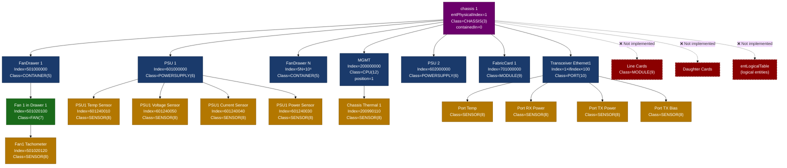

### 5.2 OID Index Encoding — 9-Digit Scheme

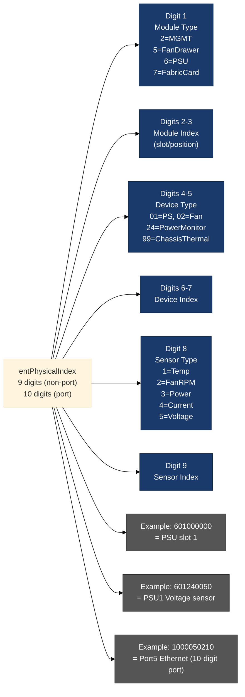

### 5.3 Entity MIB Compliance Table

| OID Suffix | Object | Status | Source |
|---|---|---|---|
| `1.1.2` | `entPhysicalDescr` | ✅ Implemented | String description from STATE_DB |
| `1.1.3` | `entPhysicalVendorType` | ⚠️ Empty string | Not populated |
| `1.1.4` | `entPhysicalContainedIn` | ✅ Implemented | Parent index computed from name-to-OID map |
| `1.1.5` | `entPhysicalClass` | ✅ Implemented | chassis/fan/sensor/module/port |
| `1.1.6` | `entPhysicalParentRelPos` | ✅ Implemented | Position within parent (-1 for transceivers) |
| `1.1.7` | `entPhysicalName` | ✅ Implemented | DB key name (e.g. `PSU 1`, `Ethernet0`) |
| `1.1.8` | `entPhysicalHardwareVersion` | ✅ Implemented | `vendor_rev` from TRANSCEIVER_INFO |
| `1.1.9` | `entPhysicalFirmwareVersion` | ⚠️ Empty string | Not populated |
| `1.1.10` | `entPhysicalSoftwareRevision` | ⚠️ Empty string | Not populated |
| `1.1.11` | `entPhysicalSerialNumber` | ✅ Implemented | Serial from PSU/FAN/XCVR info |
| `1.1.12` | `entPhysicalMfgName` | ✅ Implemented | Manufacturer from TRANSCEIVER_INFO |
| `1.1.13` | `entPhysicalModelName` | ✅ Implemented | Model from PSU/XCVR info |
| `1.1.14` | `entPhysicalAlias` | ⚠️ Empty string | Not populated |
| `1.1.15` | `entPhysicalAssetID` | ⚠️ Empty string | Not populated |
| `1.1.16` | `entPhysicalIsFRU` | ✅ Implemented | From `is_replaceable` field |
| — | `entPhysicalContainsTable` | ❌ Not implemented | Reverse containment table |
| — | `entLogicalTable` | ❌ Not implemented | Logical entity mapping |
| — | `entLPMappingTable` | ❌ Not implemented | Physical-to-logical mapping |
| — | `entAliasMappingTable` | ❌ Not implemented | Port-to-ifIndex alias mapping |
| — | `entConfigChange` trap | ❌ Not implemented | Hardware add/remove notification |
| — | Line card modules | ❌ Not implemented | No MODULE entries for line cards |
| — | `entPhysicalMfgDate` (RFC 6933) | ❌ Not implemented | Manufacturing date |

---

## 6. Entity Sensor MIB — RFC 3433

**OID Prefix:** `.1.3.6.1.2.1.99.1.1` (`entPhySensorTable`)

> Each row in this table is indexed by the **same** `entPhysicalIndex` as RFC 2737. Only entities with `entPhysicalClass = SENSOR(8)` in the Entity MIB appear here.

### 6.1 Sensor Data Pipeline

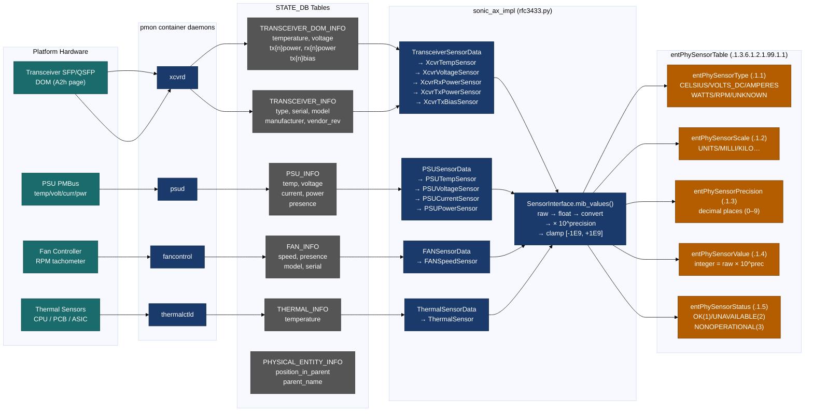

### 6.2 Sensor Type, Scale, and Precision — Reference Table

| Sensor | DB Key | TYPE | SCALE | PRECISION | Example: raw `"40.5"` → MIB value |
|---|---|---|---|---|---|
| Transceiver Temp | `temperature` | CELSIUS(8) | UNITS(9) | 6 | 40500000 |
| Transceiver Voltage | `voltage` | VOLTS_DC(4) | UNITS(9) | 4 | 33000 (3.3V) |
| Transceiver RX Power | `rx{n}power` (dBm) | WATTS(6) | MILLI(8) | 4 | dBm→mW×10000 |
| Transceiver TX Power | `tx{n}power` (dBm) | WATTS(6) | MILLI(8) | 4 | dBm→mW×10000 |
| Transceiver TX Bias | `tx{n}bias` (mA) | AMPERES(5) | MILLI(8) | 3 | 7500 (7.5mA) |
| PSU Temperature | `temp` | CELSIUS(8) | UNITS(9) | 3 | 40500 |
| PSU Voltage | `voltage` | VOLTS_DC(4) | UNITS(9) | 3 | 12000 (12V) |
| PSU Current | `current` | AMPERES(5) | UNITS(9) | 3 | 5000 (5A) |
| PSU Power | `power` | WATTS(6) | UNITS(9) | 3 | 60000 (60W) |
| Fan Speed | `speed` | UNKNOWN(2) | UNITS(9) | 0 | 3200 RPM |
| Chassis Thermal | `temperature` | CELSIUS(8) | UNITS(9) | 3 | 55000 |

> **Reading a value:** `actual = MIB_value / (10 ^ precision)`  
> Example: entPhySensorValue=40500000, PRECISION=6 → 40.5 °C

### 6.3 Entity Sensor MIB Compliance Table

| OID Suffix | Object | Status | Notes |
|---|---|---|---|
| `1.1.1` | `entPhySensorType` | ✅ Implemented | Per sensor class in `EntitySensorDataType` |
| `1.1.2` | `entPhySensorScale` | ✅ Implemented | Per sensor class |
| `1.1.3` | `entPhySensorPrecision` | ✅ Implemented | Per sensor class |
| `1.1.4` | `entPhySensorValue` | ✅ Implemented | Converted from raw Redis string |
| `1.1.5` | `entPhySensorOperStatus` | ✅ Implemented | OK / UNAVAILABLE if parse fails |
| — | `entPhySensorUnitsDisplay` | ❌ Not implemented | Human-readable unit string (e.g. `"Celsius"`) |
| — | `entPhySensorValueTimeStamp` | ❌ Not implemented | Time of last update |
| — | `entPhySensorValueUpdateRate` | ❌ Not implemented | Poll rate not exposed (internal: 5s) |
| — | Chassis voltage sensors | ❌ Not implemented | No chassis-level DC bus monitoring |
| — | ASIC die temperature | ❌ Not implemented | `ASIC_TEMPERATURE_INFO` not mapped |
| — | `entSensorThresholdTable` | ❌ Not implemented | High/low/critical thresholds not exposed |

---

## 7. Alarms and Traps

### 7.1 Current State of Traps in SONiC

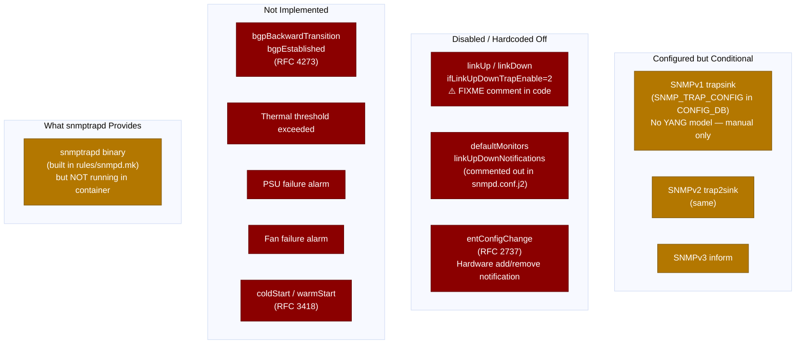

### 7.2 Trap Configuration Path (What Exists Today)

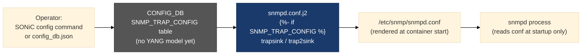

> **Gap:** `SNMP_TRAP_CONFIG` has no YANG model, no CLI, and no minigraph population. Trap sinks can only be configured by directly editing `config_db.json`. Additionally, snmpd must be restarted to pick up trap sink changes.

### 7.3 Trap / Notification Compliance Table

| Trap / Notification | OID | Status | Notes |
|---|---|---|---|
| `coldStart` | `.1.3.6.1.6.3.1.1.5.1` | ❌ Not sent | Could be sent at snmpd startup |
| `warmStart` | `.1.3.6.1.6.3.1.1.5.2` | ❌ Not sent | — |
| `linkDown` | `.1.3.6.1.6.3.1.1.5.3` | ❌ Disabled | `ifLinkUpDownTrapEnable` hardcoded 2 |
| `linkUp` | `.1.3.6.1.6.3.1.1.5.4` | ❌ Disabled | Same |
| `authenticationFailure` | `.1.3.6.1.6.3.1.1.5.5` | ⚠️ snmpd default | Only if `authtrapenable 1` in snmpd.conf |
| `entConfigChange` | `.1.3.6.1.2.1.47.2.0.1` | ❌ Not implemented | No hardware plug/unplug notification |
| `bgpEstablished` | `.1.3.6.1.2.1.15.7` | ❌ Not sent | FRR has this but not wired |
| `bgpBackwardTransition` | `.1.3.6.1.2.1.15.8` | ❌ Not sent | — |
| Thermal threshold | vendor OID | ❌ Not implemented | — |
| PSU failure | vendor OID | ❌ Not implemented | — |
| Fan failure | vendor OID | ❌ Not implemented | — |
| SNMPv3 Inform | — | ⚠️ Config-only | No YANG / CLI support |

---

## 8. Compliance Gap Summary

```mermaid
%%{init: {"theme": "base"}}%%
quadrantChart
    title SONiC SNMP Compliance — Implementation vs. Importance
    x-axis Low Importance --> High Importance
    y-axis Not Implemented --> Fully Implemented
    quadrant-1 Well Done
    quadrant-2 Over-Engineered
    quadrant-3 Low Priority Gaps
    quadrant-4 Critical Gaps — Fix First

    ifHC Counters (64-bit): [0.90, 0.95]
    Transceiver DOM Sensors: [0.85, 0.90]
    PSU Entity + Sensors: [0.80, 0.90]
    Fan Entity + Sensors: [0.75, 0.85]
    LLDP MIB: [0.70, 0.90]
    BGP Peer State: [0.65, 0.85]
    entPhysicalTable (partial): [0.80, 0.70]
    ifOperStatus: [0.90, 0.95]
    linkDown/linkUp Traps: [0.95, 0.10]
    entConfigChange Trap: [0.80, 0.05]
    ifLastChange: [0.70, 0.15]
    entSensorThresholdTable: [0.75, 0.05]
    Management IF Counters: [0.65, 0.20]
    RMON MIB: [0.30, 0.05]
    ifStackTable: [0.50, 0.10]
    Trap YANG model: [0.85, 0.05]
    OSPF MIB: [0.40, 0.10]
    ASIC Temp Sensor: [0.70, 0.10]
```

### 8.1 Prioritized Gap List

| Priority | Gap | MIB | Impact |
|---|---|---|---|
| 🔴 **P0** | `linkUp/linkDown` traps not sent | RFC 2863 | NMS cannot detect port failures |
| 🔴 **P0** | `entConfigChange` trap not sent | RFC 2737 | NMS cannot detect hardware add/remove |
| 🔴 **P0** | `SNMP_TRAP_CONFIG` has no YANG model or CLI | — | Cannot configure traps via standard tooling |
| 🟠 **P1** | `ifLastChange` always returns 0 | RFC 2863 | Cannot determine when link state changed |
| 🟠 **P1** | Management interface counters return 0 | RFC 2863 | mgmt0 bandwidth invisible to NMS |
| 🟠 **P1** | `entSensorThresholdTable` missing | RFC 3433 | Cannot poll threshold crossings via SNMP |
| 🟠 **P1** | `entPhySensorUnitsDisplay` missing | RFC 3433 | NMS must hardcode unit strings |
| 🟡 **P2** | `entPhysicalFirmwareVersion` empty | RFC 2737 | Cannot audit firmware via SNMP |
| 🟡 **P2** | ASIC die temperature not exposed | RFC 3433 | ASIC thermal blind spot |
| 🟡 **P2** | `ifStackTable` not implemented | RFC 2863 | LAG member stacking not visible |
| 🟡 **P2** | Line card entities not populated | RFC 2737 | Modular chassis incomplete |
| 🟢 **P3** | `ifPromiscuousMode` hardcoded true | RFC 2863 | Minor accuracy issue |
| 🟢 **P3** | `ifCounterDiscontinuityTime` always 0 | RFC 2863 | Counter resets invisible |
| 🟢 **P3** | `entLogicalTable` missing | RFC 2737 | Rarely queried |
| 🟢 **P3** | RMON MIB missing | RFC 2819 | Rarely required |

---

## 9. External pytest Testing Blueprint

### 9.1 Test Environment Setup

```python
# requirements.txt (test environment)
# pysnmp>=4.4.12
# pytest>=7.0
# pytest-timeout
# easysnmp  # optional C-binding alternative for speed
```

```python
# conftest.py
import pytest

def pytest_addoption(parser):
    parser.addoption("--snmp-host",    default="localhost", help="SONiC DUT IP")
    parser.addoption("--snmp-port",    default=161,         type=int)
    parser.addoption("--community",    default="public",    help="SNMPv2c community")
    parser.addoption("--snmp-version", default="2c",        choices=["1","2c","3"])

@pytest.fixture(scope="session")
def snmp_cfg(request):
    return {
        "host":      request.config.getoption("--snmp-host"),
        "port":      request.config.getoption("--snmp-port"),
        "community": request.config.getoption("--community"),
        "version":   request.config.getoption("--snmp-version"),
    }

# Usage:
# pytest tests/ --snmp-host 10.1.1.1 --community mycomm -v
```

### 9.2 SNMP Helper Utility

```python
# tests/snmp_util.py
from pysnmp.hlapi import (
    SnmpEngine, CommunityData, UdpTransportTarget, ContextData,
    ObjectType, ObjectIdentity, getCmd, nextCmd, bulkCmd
)

class SnmpClient:
    def __init__(self, host, port=161, community="public"):
        self.engine    = SnmpEngine()
        self.community = CommunityData(community, mpModel=1)  # mpModel=1 → SNMPv2c
        self.transport = UdpTransportTarget((host, port), timeout=5, retries=2)
        self.context   = ContextData()

    def get(self, oid: str):
        """Single OID GET. Returns (oid_str, value) or raises."""
        err_indication, err_status, err_index, var_binds = next(
            getCmd(self.engine, self.community, self.transport, self.context,
                   ObjectType(ObjectIdentity(oid)))
        )
        self._check(err_indication, err_status, err_index)
        return str(var_binds[0][0]), var_binds[0][1]

    def walk(self, oid: str) -> list:
        """GETNEXT walk from oid. Returns list of (oid_str, value)."""
        results = []
        for err_indication, err_status, err_index, var_binds in nextCmd(
            self.engine, self.community, self.transport, self.context,
            ObjectType(ObjectIdentity(oid)), lexicographicMode=False
        ):
            self._check(err_indication, err_status, err_index)
            for vb in var_binds:
                results.append((str(vb[0]), vb[1]))
        return results

    def bulk_walk(self, oid: str, max_repetitions=25) -> list:
        """GETBULK walk. More efficient than walk() for large tables."""
        results = []
        for err_indication, err_status, err_index, var_binds in bulkCmd(
            self.engine, self.community, self.transport, self.context,
            0, max_repetitions,
            ObjectType(ObjectIdentity(oid)), lexicographicMode=False
        ):
            self._check(err_indication, err_status, err_index)
            for vb in var_binds:
                results.append((str(vb[0]), vb[1]))
        return results

    @staticmethod
    def _check(err_indication, err_status, err_index):
        if err_indication:
            raise RuntimeError(f"SNMP error: {err_indication}")
        if err_status:
            raise RuntimeError(f"SNMP PDU error: {err_status.prettyPrint()} at {err_index}")
```

### 9.3 Interface MIB Tests

```python
# tests/test_interface_mib.py
"""
Validates RFC 1213 ifTable and RFC 2863 ifXTable.
"""
import pytest
from snmp_util import SnmpClient

IF_TABLE         = "1.3.6.1.2.1.2.2.1"
IF_X_TABLE       = "1.3.6.1.2.1.31.1.1.1"
IF_DESCR         = "1.3.6.1.2.1.2.2.1.2"
IF_OPER_STATUS   = "1.3.6.1.2.1.2.2.1.8"
IF_HC_IN_OCTETS  = "1.3.6.1.2.1.31.1.1.1.6"
IF_HC_OUT_OCTETS = "1.3.6.1.2.1.31.1.1.1.10"
IF_HIGH_SPEED    = "1.3.6.1.2.1.31.1.1.1.15"
IF_ALIAS         = "1.3.6.1.2.1.31.1.1.1.18"
IF_LINK_TRAP     = "1.3.6.1.2.1.31.1.1.1.14"


@pytest.fixture(scope="module")
def snmp(snmp_cfg):
    return SnmpClient(snmp_cfg["host"], snmp_cfg["port"], snmp_cfg["community"])


class TestIfTable:
    def test_if_table_not_empty(self, snmp):
        """At least one interface must be present."""
        rows = snmp.bulk_walk(IF_TABLE)
        assert len(rows) > 0, "ifTable is empty — no interfaces found"

    def test_if_descr_non_empty(self, snmp):
        """Every interface must have a non-empty ifDescr."""
        rows = snmp.walk(IF_DESCR)
        for oid, val in rows:
            assert str(val).strip() != "", f"Empty ifDescr at {oid}"

    def test_if_oper_status_valid(self, snmp):
        """ifOperStatus must be 1 (up), 2 (down), or 5 (dormant)."""
        rows = snmp.walk(IF_OPER_STATUS)
        valid = {1, 2, 3, 4, 5, 6, 7}
        for oid, val in rows:
            assert int(val) in valid, f"Invalid ifOperStatus {val} at {oid}"


class TestIfXTable:
    def test_hc_counters_are_64bit(self, snmp):
        """ifHCInOctets must be Counter64 type."""
        from pysnmp.proto.rfc1902 import Counter64
        rows = snmp.walk(IF_HC_IN_OCTETS)
        assert len(rows) > 0, "No ifHCInOctets entries — ifXTable may be empty"
        for oid, val in rows:
            assert isinstance(val, Counter64), \
                f"Expected Counter64 at {oid}, got {type(val).__name__}"

    def test_hc_counters_non_negative(self, snmp):
        """HC counters must be >= 0."""
        for base_oid in [IF_HC_IN_OCTETS, IF_HC_OUT_OCTETS]:
            for oid, val in snmp.walk(base_oid):
                assert int(val) >= 0, f"Negative counter at {oid}"

    def test_high_speed_reasonable(self, snmp):
        """ifHighSpeed must be > 0 for physical interfaces."""
        rows = snmp.walk(IF_HIGH_SPEED)
        speeds = [int(v) for _, v in rows]
        assert any(s > 0 for s in speeds), "All ifHighSpeed values are 0"

    def test_link_trap_enable_is_disabled(self, snmp):
        """
        KNOWN GAP: ifLinkUpDownTrapEnable is hardcoded disabled(2).
        This test documents the gap — it should FAIL once traps are enabled.
        """
        rows = snmp.walk(IF_LINK_TRAP)
        for oid, val in rows:
            # Document current state: value == 2 (disabled)
            # To fix: implement trap sending and change assertion to == 1
            assert int(val) == 2, \
                f"UNEXPECTED: ifLinkUpDownTrapEnable={val} at {oid} " \
                f"(traps may now be enabled — update this test)"

    def test_if_alias_present(self, snmp):
        """ifAlias should return a value (may be empty string)."""
        rows = snmp.walk(IF_ALIAS)
        assert len(rows) > 0, "No ifAlias entries found"
```

### 9.4 Entity MIB Tests (RFC 2737)

```python
# tests/test_entity_mib.py
"""
Validates RFC 2737 entPhysicalTable.
"""
import pytest
from snmp_util import SnmpClient

ENT_PHYS_TABLE   = "1.3.6.1.2.1.47.1.1.1"
ENT_PHYS_DESCR   = "1.3.6.1.2.1.47.1.1.1.1.2"
ENT_PHYS_CLASS   = "1.3.6.1.2.1.47.1.1.1.1.5"
ENT_CONTAINED_IN = "1.3.6.1.2.1.47.1.1.1.1.4"
ENT_SERIAL       = "1.3.6.1.2.1.47.1.1.1.1.11"
ENT_IS_FRU       = "1.3.6.1.2.1.47.1.1.1.1.16"
ENT_MODEL        = "1.3.6.1.2.1.47.1.1.1.1.13"

# PhysicalClass enum values (RFC 2737)
CLASS_CHASSIS     = 3
CLASS_CONTAINER   = 5
CLASS_POWERSUPPLY = 6
CLASS_FAN         = 7
CLASS_SENSOR      = 8
CLASS_MODULE      = 9
CLASS_PORT        = 10
CLASS_CPU         = 12


@pytest.fixture(scope="module")
def snmp(snmp_cfg):
    return SnmpClient(snmp_cfg["host"], snmp_cfg["port"], snmp_cfg["community"])


@pytest.fixture(scope="module")
def entity_table(snmp):
    """Walk entire entPhysicalTable and return dict of index → class."""
    classes = {}
    for oid, val in snmp.walk(ENT_PHYS_CLASS):
        idx = int(oid.split(".")[-1])
        classes[idx] = int(val)
    return classes


class TestEntityTable:
    def test_table_not_empty(self, entity_table):
        assert len(entity_table) > 0, "entPhysicalTable is empty"

    def test_chassis_present(self, entity_table):
        """There must be exactly one chassis entity."""
        chassis = [idx for idx, cls in entity_table.items() if cls == CLASS_CHASSIS]
        assert len(chassis) == 1, f"Expected 1 chassis, found {len(chassis)}: {chassis}"

    def test_chassis_index_is_one(self, entity_table):
        """Chassis must have entPhysicalIndex = 1."""
        assert 1 in entity_table and entity_table[1] == CLASS_CHASSIS, \
            "Chassis entity not at index 1"

    def test_sensors_present(self, entity_table):
        """At least one sensor entity must exist."""
        sensors = [idx for idx, cls in entity_table.items() if cls == CLASS_SENSOR]
        assert len(sensors) > 0, "No sensor entities in entPhysicalTable"

    def test_contained_in_chain_valid(self, snmp, entity_table):
        """
        Every entity's entPhysicalContainedIn must point to a valid index
        OR be 0 (chassis root).
        """
        contained_rows = dict(
            (int(oid.split(".")[-1]), int(val))
            for oid, val in snmp.walk(ENT_CONTAINED_IN)
        )
        for idx, parent in contained_rows.items():
            if parent == 0:
                continue  # root of tree
            assert parent in entity_table, \
                f"Entity {idx} containedIn={parent} which does not exist in table"

    def test_psu_has_serial(self, snmp, entity_table):
        """PSU entities should have serial numbers."""
        psu_indices = [idx for idx, cls in entity_table.items() if cls == CLASS_POWERSUPPLY]
        if not psu_indices:
            pytest.skip("No PSU entities found")
        for idx in psu_indices:
            _, val = snmp.get(f"{ENT_SERIAL}.{idx}")
            # Not asserting non-empty — some platforms may not populate serial
            # Document what we find:
            print(f"PSU {idx} serial: '{val}'")

    def test_fru_values_valid(self, snmp):
        """entPhysicalIsFRU must be 1 (true) or 2 (false)."""
        for oid, val in snmp.walk(ENT_IS_FRU):
            assert int(val) in {1, 2}, f"Invalid isFRU value {val} at {oid}"

    def test_known_gaps_firmware_version(self, snmp):
        """
        KNOWN GAP: entPhysicalFirmwareVersion is always empty.
        This test documents the gap.
        """
        FW_VER = "1.3.6.1.2.1.47.1.1.1.1.9"
        non_empty = [(oid, str(val)) for oid, val in snmp.walk(FW_VER) if str(val).strip()]
        # Currently expect all empty — when fixed, this will start passing with values
        if non_empty:
            print(f"Firmware versions now populated: {non_empty[:3]}")
        # Don't hard-fail — just report
```

### 9.5 Entity Sensor MIB Tests (RFC 3433)

```python
# tests/test_sensor_mib.py
"""
Validates RFC 3433 entPhySensorTable.
Cross-references indices with entPhysicalTable to confirm sensor linkage.
"""
import pytest
from snmp_util import SnmpClient

ENT_SENSOR_TABLE = "1.3.6.1.2.1.99.1.1"
SENSOR_TYPE      = "1.3.6.1.2.1.99.1.1.1.1"
SENSOR_SCALE     = "1.3.6.1.2.1.99.1.1.1.2"
SENSOR_PRECISION = "1.3.6.1.2.1.99.1.1.1.3"
SENSOR_VALUE     = "1.3.6.1.2.1.99.1.1.1.4"
SENSOR_STATUS    = "1.3.6.1.2.1.99.1.1.1.5"

ENT_PHYS_CLASS   = "1.3.6.1.2.1.47.1.1.1.1.5"
CLASS_SENSOR     = 8

# EntitySensorDataType values (RFC 3433)
SENSOR_TYPE_MAP = {1:"other", 2:"unknown", 3:"voltsAC", 4:"voltsDC",
                   5:"amperes", 6:"watts", 7:"hertz", 8:"celsius",
                   9:"percentRH", 10:"rpm", 11:"cmm", 12:"truthvalue"}
SENSOR_STATUS_OK          = 1
SENSOR_STATUS_UNAVAILABLE = 2


@pytest.fixture(scope="module")
def snmp(snmp_cfg):
    return SnmpClient(snmp_cfg["host"], snmp_cfg["port"], snmp_cfg["community"])


@pytest.fixture(scope="module")
def sensor_indices(snmp):
    return [int(oid.split(".")[-1]) for oid, _ in snmp.walk(SENSOR_TYPE)]


class TestSensorMIB:
    def test_sensor_table_not_empty(self, sensor_indices):
        assert len(sensor_indices) > 0, "entPhySensorTable is empty — no sensors found"

    def test_sensor_indices_match_entity_sensors(self, snmp, sensor_indices):
        """Every sensor index in RFC 3433 must be CLASS_SENSOR in RFC 2737."""
        for idx in sensor_indices:
            _, cls_val = snmp.get(f"{ENT_PHYS_CLASS}.{idx}")
            assert int(cls_val) == CLASS_SENSOR, \
                f"Index {idx} in entPhySensorTable but entPhysicalClass={cls_val} (not SENSOR)"

    def test_sensor_type_valid(self, snmp, sensor_indices):
        """entPhySensorType must be a known value (1–12)."""
        for idx in sensor_indices:
            _, val = snmp.get(f"{SENSOR_TYPE}.{idx}")
            assert int(val) in SENSOR_TYPE_MAP, \
                f"Unknown sensor type {val} at index {idx}"

    def test_sensor_precision_in_range(self, snmp, sensor_indices):
        """entPhySensorPrecision must be in [-8, 9] per RFC 3433."""
        for idx in sensor_indices:
            _, val = snmp.get(f"{SENSOR_PRECISION}.{idx}")
            assert -8 <= int(val) <= 9, \
                f"Precision {val} out of range at index {idx}"

    def test_sensor_value_in_range(self, snmp, sensor_indices):
        """entPhySensorValue must be in [-1,000,000,000 .. 1,000,000,000]."""
        for idx in sensor_indices:
            _, val = snmp.get(f"{SENSOR_VALUE}.{idx}")
            assert -1_000_000_000 <= int(val) <= 1_000_000_000, \
                f"Sensor value {val} out of RFC range at index {idx}"

    def test_sensor_status_valid(self, snmp, sensor_indices):
        """entPhySensorOperStatus must be 1 (OK), 2 (unavailable), or 3 (nonoperational)."""
        for idx in sensor_indices:
            _, val = snmp.get(f"{SENSOR_STATUS}.{idx}")
            assert int(val) in {1, 2, 3}, \
                f"Invalid sensor status {val} at index {idx}"

    def test_temperature_sensors_reasonable(self, snmp, sensor_indices):
        """
        Celsius sensors (type=8, scale=UNITS, precision=3 or 6) should read
        between -10 and 120 °C when status is OK.
        """
        CELSIUS = 8
        UNITS_SCALE = 9
        for idx in sensor_indices:
            _, type_val  = snmp.get(f"{SENSOR_TYPE}.{idx}")
            _, scale_val = snmp.get(f"{SENSOR_SCALE}.{idx}")
            _, prec_val  = snmp.get(f"{SENSOR_PRECISION}.{idx}")
            _, stat_val  = snmp.get(f"{SENSOR_STATUS}.{idx}")
            _, raw_val   = snmp.get(f"{SENSOR_VALUE}.{idx}")

            if int(type_val) != CELSIUS or int(scale_val) != UNITS_SCALE:
                continue
            if int(stat_val) != SENSOR_STATUS_OK:
                continue

            actual_temp = int(raw_val) / (10 ** int(prec_val))
            assert -10 <= actual_temp <= 120, \
                f"Temperature {actual_temp}°C out of expected range at index {idx}"

    def test_known_gap_units_display_missing(self, snmp):
        """
        KNOWN GAP: entPhySensorUnitsDisplay (.1.3.6.1.2.1.99.1.1.1.6) is not implemented.
        Walking this OID should return no entries.
        """
        UNITS_DISPLAY = "1.3.6.1.2.1.99.1.1.1.6"
        rows = snmp.walk(UNITS_DISPLAY)
        assert len(rows) == 0, \
            f"entPhySensorUnitsDisplay now returns {len(rows)} entries — gap may be fixed!"
```

### 9.6 Trap Testing (Requires External Trap Receiver)

```python
# tests/test_traps.py
"""
Tests for SNMP traps. Requires a trap listener running on the test host.
Run with: pytest tests/test_traps.py --trap-listen-ip 10.0.0.5

KNOWN GAPS:
  - linkDown/linkUp traps are DISABLED in current SONiC
  - entConfigChange trap is NOT implemented
  These tests document the expected behavior for future implementation.
"""
import pytest
import socket
import threading
import time

def pytest_addoption(parser):
    parser.addoption("--trap-listen-ip", default=None,
                     help="IP to listen for traps (test host IP reachable from DUT)")


@pytest.fixture(scope="module")
def trap_listener(request):
    """Simple UDP trap listener. Collects raw trap PDUs."""
    listen_ip = request.config.getoption("--trap-listen-ip")
    if not listen_ip:
        pytest.skip("--trap-listen-ip not provided")

    received = []
    sock = socket.socket(socket.AF_INET, socket.SOCK_DGRAM)
    sock.bind((listen_ip, 162))
    sock.settimeout(0.5)

    def listen():
        while not stop_event.is_set():
            try:
                data, addr = sock.recvfrom(4096)
                received.append((addr, data))
            except socket.timeout:
                pass

    stop_event = threading.Event()
    t = threading.Thread(target=listen, daemon=True)
    t.start()
    yield received
    stop_event.set()
    t.join(timeout=2)
    sock.close()


class TestTraps:
    @pytest.mark.xfail(reason="KNOWN GAP: linkDown traps are hardcoded disabled in SONiC")
    def test_linkdown_trap_on_port_shutdown(self, snmp_cfg, trap_listener):
        """
        EXPECTED BEHAVIOR (not yet implemented):
        Shutting down a port should generate a linkDown trap.
        Mark xfail until ifLinkUpDownTrapEnable is implemented.
        """
        # To implement: use SONiC CLI or REST API to admin-shutdown a port,
        # then verify trap_listener receives a linkDown PDU.
        # linkDown OID: .1.3.6.1.6.3.1.1.5.3
        time.sleep(5)  # wait for potential trap
        linkdown_oid = b'\x06\x0a\x2b\x06\x01\x06\x03\x01\x01\x05\x03'
        received_linkdown = any(linkdown_oid in data for _, data in trap_listener)
        assert received_linkdown, "No linkDown trap received after port shutdown"

    @pytest.mark.xfail(reason="KNOWN GAP: entConfigChange trap not implemented")
    def test_ent_config_change_on_xcvr_insert(self, trap_listener):
        """
        EXPECTED BEHAVIOR: Inserting/removing a transceiver should
        trigger an entConfigChange trap.
        """
        time.sleep(5)
        ent_change_oid = b'\x2b\x06\x01\x02\x01\x2f\x02'
        received = any(ent_change_oid in data for _, data in trap_listener)
        assert received, "No entConfigChange trap received after transceiver event"
```

### 9.7 Running the Full Test Suite

```bash
# Install test dependencies
pip install pysnmp pytest pytest-timeout

# Run all MIB tests against a live SONiC device
pytest tests/ \
    --snmp-host 10.1.1.1 \
    --community public \
    -v \
    --timeout=30 \
    -p no:warnings \
    --tb=short \
    2>&1 | tee snmp_compliance_results.txt

# Run only sensor tests with verbose output
pytest tests/test_sensor_mib.py -v --snmp-host 10.1.1.1

# Run trap tests (requires trap listener IP)
pytest tests/test_traps.py \
    --snmp-host 10.1.1.1 \
    --trap-listen-ip 10.0.0.5 \
    -v

# Generate JUnit XML for CI
pytest tests/ --snmp-host 10.1.1.1 --junitxml=snmp_results.xml
```

---

## Appendix A — Quick OID Reference

| MIB | Object | OID |
|---|---|---|
| MIB-II | `sysDescr` | `.1.3.6.1.2.1.1.1.0` |
| MIB-II | `sysName` | `.1.3.6.1.2.1.1.5.0` |
| MIB-II | `sysLocation` | `.1.3.6.1.2.1.1.6.0` |
| MIB-II | `ifTable` | `.1.3.6.1.2.1.2.2` |
| RFC 2863 | `ifXTable` | `.1.3.6.1.2.1.31.1.1` |
| RFC 2863 | `ifHCInOctets` | `.1.3.6.1.2.1.31.1.1.1.6.{ifIndex}` |
| RFC 2863 | `ifHCOutOctets` | `.1.3.6.1.2.1.31.1.1.1.10.{ifIndex}` |
| RFC 2863 | `ifHighSpeed` | `.1.3.6.1.2.1.31.1.1.1.15.{ifIndex}` |
| RFC 2737 | `entPhysicalTable` | `.1.3.6.1.2.1.47.1.1.1` |
| RFC 2737 | `entPhysicalClass` | `.1.3.6.1.2.1.47.1.1.1.1.5.{index}` |
| RFC 2737 | `entPhysicalSerialNum` | `.1.3.6.1.2.1.47.1.1.1.1.11.{index}` |
| RFC 3433 | `entPhySensorTable` | `.1.3.6.1.2.1.99.1.1` |
| RFC 3433 | `entPhySensorValue` | `.1.3.6.1.2.1.99.1.1.1.4.{index}` |
| RFC 3433 | `entPhySensorStatus` | `.1.3.6.1.2.1.99.1.1.1.5.{index}` |
| IEEE 802.1AB | `lldpRemTable` | `.1.0.8802.1.1.2.1.4.1` |
| BGP-MIB | `bgpPeerTable` | `.1.3.6.1.2.1.15.3` |
| Cisco BGP4 | `cbgpPeer2Table` | `.1.3.6.1.4.1.9.9.187.1.2.5` |

## Appendix B — snmpwalk Cheat Sheet

```bash
# Walk entire entity table
snmpwalk -v2c -c public 10.1.1.1 .1.3.6.1.2.1.47.1.1.1

# Get all sensor values
snmpwalk -v2c -c public 10.1.1.1 .1.3.6.1.2.1.99.1.1.1.4

# Get 64-bit interface counters for all ports
snmpwalk -v2c -c public 10.1.1.1 .1.3.6.1.2.1.31.1.1.1.6

# Bulk walk interface table (faster)
snmpbulkwalk -v2c -c public 10.1.1.1 .1.3.6.1.2.1.31.1.1

# Check sysDescr (verifies SNMP is alive)
snmpget -v2c -c public 10.1.1.1 .1.3.6.1.2.1.1.1.0

# Get single sensor value (e.g. PSU1 temperature)
snmpget -v2c -c public 10.1.1.1 .1.3.6.1.2.1.99.1.1.1.4.601240010

# Listen for traps (on NMS side)
snmptrapd -f -Lo -c /dev/null udp:162
```

---

*Document generated from live code analysis of `sonic-snmpagent` commit `329f1cca` and `sonic-buildimage` main.*  
*Branch: `thongal_nms_snmp1` | Path: `src/sonic-snmpagent/upscaleai/compliance.md`*
