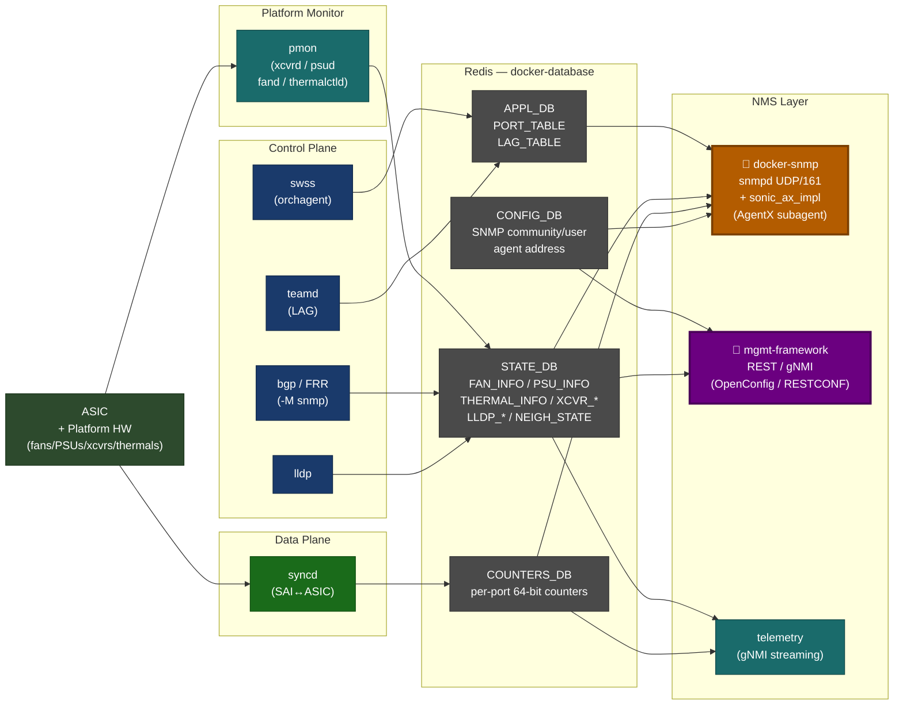
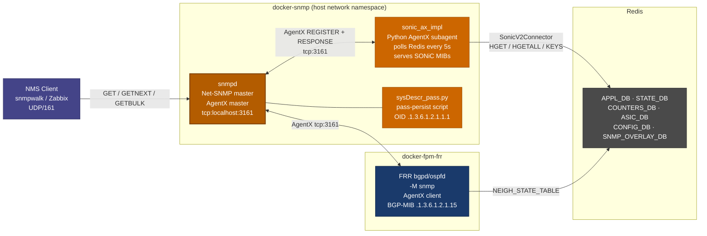
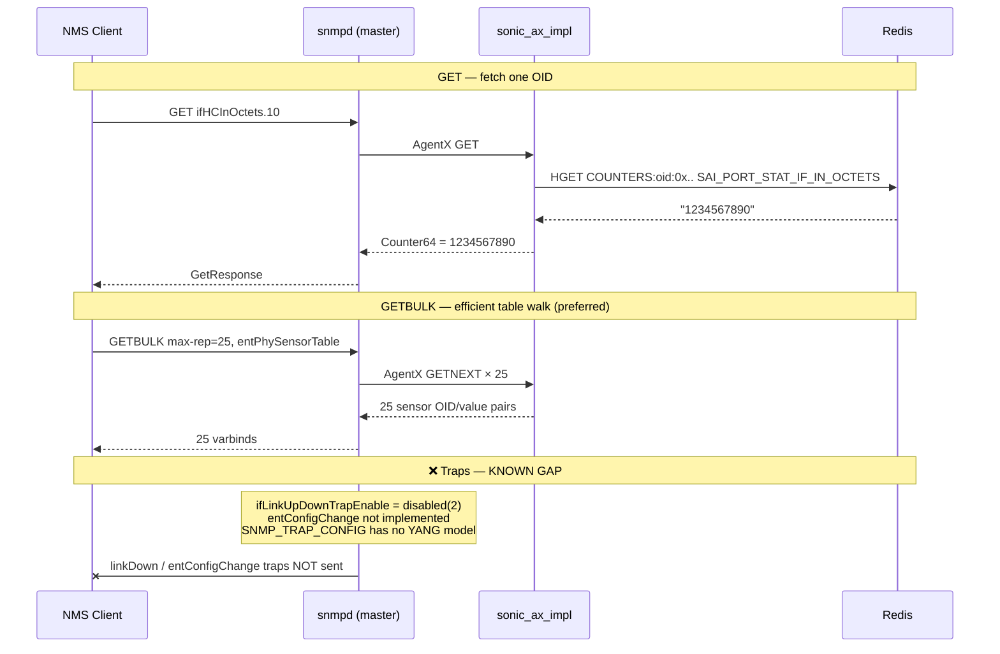
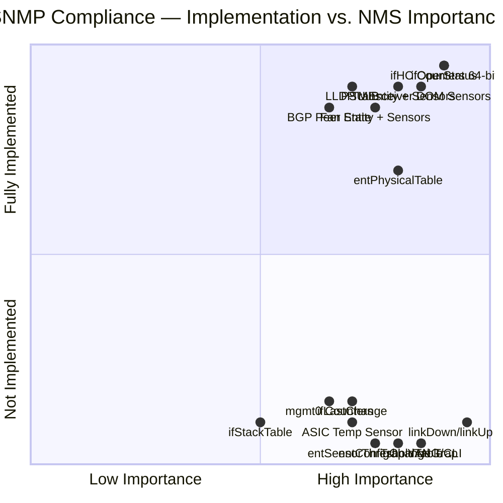

# SONiC SNMP — Initial Compliance Requirements

> **Audience:** Medium-to-advanced NMS / test engineers.  
> **Purpose:** Map what SONiC implements vs. what compliance requires across Entity MIB, Sensor MIB, Interface MIB, and Traps — and provide a pytest testing blueprint.

---

## Table of Contents

1. [SONiC Architecture & SNMP Position](#1-sonic-architecture--snmp-position)
2. [SNMP Stack & Data Flow](#2-snmp-stack--data-flow)
3. [SNMP Operations Primer](#3-snmp-operations-primer)
4. [MIB Compliance Tables](#4-mib-compliance-tables)
   - [Interface MIB — RFC 1213 / RFC 2863](#41-interface-mib--rfc-1213--rfc-2863)
   - [Entity MIB — RFC 2737](#42-entity-mib--rfc-2737)
   - [Entity Sensor MIB — RFC 3433](#43-entity-sensor-mib--rfc-3433)
   - [Alarms & Traps](#44-alarms--traps)
5. [Compliance Gap Summary](#5-compliance-gap-summary)
6. [External pytest Testing Blueprint](#6-external-pytest-testing-blueprint)

---

## 1. SONiC Architecture & SNMP Position

All major SONiC containers shown left-to-right. **`docker-snmp`** (orange) and **`mgmt-framework`** (purple) are the primary NMS-facing containers. Data flows right from hardware/platform → Redis → NMS layer.



---

## 2. SNMP Stack & Data Flow

How a GET request travels from NMS client through net-snmp → Python subagent → Redis, and how FRR contributes BGP MIBs via the same AgentX socket.



---

## 3. SNMP Operations Primer

Key PDU flows — GET for single values, GETBULK for table walks, and the current trap gap.



---

## 4. MIB Compliance Tables

### 4.1 Interface MIB — RFC 1213 / RFC 2863

| OID | Object | Status | Notes |
|---|---|---|---|
| `.2.2.1.2` | `ifDescr` | ✅ | Interface alias |
| `.2.2.1.3` | `ifType` | ✅ | ethernetCsmacd(6), propVirtual(53) |
| `.2.2.1.4` | `ifMtu` | ✅ | From PORT_TABLE |
| `.2.2.1.5` | `ifSpeed` | ✅ | 32-bit, capped — use `ifHighSpeed` for 100G+ |
| `.2.2.1.6` | `ifPhysAddress` | ✅ | MAC address |
| `.2.2.1.7` | `ifAdminStatus` | ✅ | up(1) / down(2) |
| `.2.2.1.8` | `ifOperStatus` | ✅ | up(1) / down(2) / dormant(5) |
| `.2.2.1.9` | `ifLastChange` | ⚠️ | Always returns 0 — no timestamp tracking |
| `.2.2.1.10`–`.21` | `ifIn/Out*` | ✅ | 32-bit counters (wrap at 4G) |
| `.31.1.1.1.6`–`.13` | `ifHCIn/OutOctets` etc. | ✅ | **64-bit HC counters — use these** |
| `.31.1.1.1.14` | `ifLinkUpDownTrapEnable` | ❌ | Hardcoded `disabled(2)` — traps never fire |
| `.31.1.1.1.15` | `ifHighSpeed` | ✅ | Mbps, correct for 100G / 400G |
| `.31.1.1.1.16` | `ifPromiscuousMode` | ⚠️ | Hardcoded `true(1)` |
| `.31.1.1.1.17` | `ifConnectorPresent` | ⚠️ | Hardcoded `true(1)` |
| `.31.1.1.1.18` | `ifAlias` | ✅ | Interface `description` field |
| `.31.1.1.1.19` | `ifCounterDiscontinuityTime` | ⚠️ | Always returns 0 |
| — | `ifStackTable` | ❌ | LAG member-to-LAG stacking not exposed |
| — | Management interface counters | ❌ | mgmt0 counters always return 0 |

---

### 4.2 Entity MIB — RFC 2737

**OID Prefix:** `.1.3.6.1.2.1.47.1.1.1`

**Physical Entity Tree — what SONiC builds (chassis → modules → devices → sensors):**

| Level | Entity | Class | entPhysicalIndex | Source |
|---|---|---|---|---|
| 0 (root) | `chassis 1` | CHASSIS(3) | `1` | `DEVICE_METADATA` |
| 1 | MGMT CPU | CPU(12) | `200000000` | hardcoded |
| 1 | Fan Drawer N | CONTAINER(5) | `5N×10⁶` | `FAN_DRAWER_INFO` |
| 1 | PSU N | POWERSUPPLY(6) | `6N×10⁶` | `PSU_INFO` |
| 1 | Fabric Card N | MODULE(9) | `7N×10⁶` | `CHASSIS_MODULE_TABLE` |
| 1 | Transceiver (port) | PORT(10) | `10⁹ + ifindex×100` | `TRANSCEIVER_INFO` |
| 2 | Fan in drawer | FAN(7) | parent + `0202NN00` | `FAN_INFO` |
| 2 | PSU sensors (×4) | SENSOR(8) | parent + `240010–50` | `PSU_INFO` |
| 2 | Chassis thermals | SENSOR(8) | `200990NN0` | `THERMAL_INFO` |
| 2 | Transceiver sensors | SENSOR(8) | port_oid + offset | `TRANSCEIVER_DOM_INFO` |

**OID Column Compliance:**

| OID Suffix | Object | Status | Notes |
|---|---|---|---|
| `1.1.2` | `entPhysicalDescr` | ✅ | String from STATE_DB |
| `1.1.3` | `entPhysicalVendorType` | ⚠️ | Always empty |
| `1.1.4` | `entPhysicalContainedIn` | ✅ | Parent index via name→OID map |
| `1.1.5` | `entPhysicalClass` | ✅ | chassis / fan / sensor / module / port |
| `1.1.6` | `entPhysicalParentRelPos` | ✅ | Slot position (-1 for transceivers) |
| `1.1.7` | `entPhysicalName` | ✅ | DB key name |
| `1.1.8` | `entPhysicalHardwareVersion` | ✅ | `vendor_rev` from TRANSCEIVER_INFO |
| `1.1.9` | `entPhysicalFirmwareVersion` | ⚠️ | Always empty |
| `1.1.10` | `entPhysicalSoftwareRevision` | ⚠️ | Always empty |
| `1.1.11` | `entPhysicalSerialNumber` | ✅ | From PSU / FAN / XCVR info |
| `1.1.12` | `entPhysicalMfgName` | ✅ | Manufacturer from TRANSCEIVER_INFO |
| `1.1.13` | `entPhysicalModelName` | ✅ | Model from PSU / XCVR info |
| `1.1.14` | `entPhysicalAlias` | ⚠️ | Always empty |
| `1.1.15` | `entPhysicalAssetID` | ⚠️ | Always empty |
| `1.1.16` | `entPhysicalIsFRU` | ✅ | From `is_replaceable` field |
| — | `entPhysicalContainsTable` | ❌ | Reverse containment not exposed |
| — | `entLogicalTable` | ❌ | Not implemented |
| — | `entConfigChange` trap | ❌ | Hardware add/remove notification missing |
| — | Line card modules | ❌ | No MODULE entries for line cards |

---

### 4.3 Entity Sensor MIB — RFC 3433

**OID Prefix:** `.1.3.6.1.2.1.99.1.1` — indexed by same `entPhysicalIndex` as RFC 2737 SENSOR entries.

**Sensor type / scale / precision — quick reference:**

| Sensor Source | DB Table / Key | TYPE | SCALE | PRECISION | Decode: `value / 10^precision` |
|---|---|---|---|---|---|
| Transceiver temperature | `TRANSCEIVER_DOM_INFO` → `temperature` | CELSIUS(8) | UNITS(9) | 6 | e.g. 40500000 → 40.5 °C |
| Transceiver voltage | `voltage` | VOLTS_DC(4) | UNITS(9) | 4 | 33000 → 3.3 V |
| Transceiver RX power | `rx{n}power` (dBm → mW) | WATTS(6) | MILLI(8) | 4 | dBm converted to mW × 10⁴ |
| Transceiver TX power | `tx{n}power` (dBm → mW) | WATTS(6) | MILLI(8) | 4 | same |
| Transceiver TX bias | `tx{n}bias` | AMPERES(5) | MILLI(8) | 3 | 7500 → 7.5 mA |
| PSU temperature | `PSU_INFO` → `temp` | CELSIUS(8) | UNITS(9) | 3 | 40500 → 40.5 °C |
| PSU voltage | `voltage` | VOLTS_DC(4) | UNITS(9) | 3 | 12000 → 12 V |
| PSU current | `current` | AMPERES(5) | UNITS(9) | 3 | 5000 → 5 A |
| PSU power | `power` | WATTS(6) | UNITS(9) | 3 | 60000 → 60 W |
| Fan speed | `FAN_INFO` → `speed` | UNKNOWN(2) | UNITS(9) | 0 | raw RPM |
| Chassis thermal | `THERMAL_INFO` → `temperature` | CELSIUS(8) | UNITS(9) | 3 | 55000 → 55 °C |

**OID Column Compliance:**

| OID Suffix | Object | Status | Notes |
|---|---|---|---|
| `1.1.1` | `entPhySensorType` | ✅ | Per `EntitySensorDataType` enum |
| `1.1.2` | `entPhySensorScale` | ✅ | Per sensor class |
| `1.1.3` | `entPhySensorPrecision` | ✅ | Per sensor class |
| `1.1.4` | `entPhySensorValue` | ✅ | Converted from raw Redis string |
| `1.1.5` | `entPhySensorOperStatus` | ✅ | OK(1) / UNAVAILABLE(2) if parse fails |
| `1.1.6` | `entPhySensorUnitsDisplay` | ❌ | Not implemented — NMS must hardcode unit strings |
| `1.1.7` | `entPhySensorValueTimeStamp` | ❌ | No timestamp exposed (internal poll: 5s) |
| `1.1.8` | `entPhySensorValueUpdateRate` | ❌ | Not exposed |
| — | `entSensorThresholdTable` | ❌ | High/low/critical thresholds not exposed |
| — | ASIC die temperature | ❌ | `ASIC_TEMPERATURE_INFO` not mapped |

---

### 4.4 Alarms & Traps

| Trap / Notification | OID | Status | Notes |
|---|---|---|---|
| `coldStart` | `.1.3.6.1.6.3.1.1.5.1` | ❌ | Not sent at snmpd startup |
| `warmStart` | `.1.3.6.1.6.3.1.1.5.2` | ❌ | Not sent |
| `linkDown` | `.1.3.6.1.6.3.1.1.5.3` | ❌ | `ifLinkUpDownTrapEnable` hardcoded 2 |
| `linkUp` | `.1.3.6.1.6.3.1.1.5.4` | ❌ | Same |
| `authenticationFailure` | `.1.3.6.1.6.3.1.1.5.5` | ⚠️ | snmpd default if `authtrapenable 1` |
| `entConfigChange` | `.1.3.6.1.2.1.47.2.0.1` | ❌ | No hardware add/remove notification |
| `bgpEstablished` | `.1.3.6.1.2.1.15.7` | ❌ | FRR supports it but not wired |
| `bgpBackwardTransition` | `.1.3.6.1.2.1.15.8` | ❌ | Same |
| Thermal / PSU / Fan alarms | vendor OIDs | ❌ | Not implemented |
| Trap sink configuration | `SNMP_TRAP_CONFIG` | ⚠️ | Config-only via `config_db.json` — no YANG model or CLI |

---

## 5. Compliance Gap Summary



**Prioritized gaps — fix in this order:**

| Priority | Gap | Impact |
|---|---|---|
| 🔴 P0 | `linkUp/linkDown` traps disabled | NMS cannot detect port failures |
| 🔴 P0 | `entConfigChange` trap missing | NMS cannot detect hardware add/remove |
| 🔴 P0 | `SNMP_TRAP_CONFIG` has no YANG model or CLI | Cannot configure trap sinks via standard tooling |
| 🟠 P1 | `ifLastChange` always 0 | Cannot determine when link state last changed |
| 🟠 P1 | mgmt0 interface counters return 0 | Management port bandwidth invisible to NMS |
| 🟠 P1 | `entSensorThresholdTable` missing | Threshold crossings not pollable via SNMP |
| 🟠 P1 | `entPhySensorUnitsDisplay` missing | NMS must hardcode unit strings |
| 🟡 P2 | `entPhysicalFirmwareVersion` empty | Cannot audit firmware via SNMP |
| 🟡 P2 | ASIC die temperature not exposed | Thermal blind spot |
| 🟡 P2 | `ifStackTable` not implemented | LAG membership stacking not visible |
| 🟡 P2 | Line card MODULE entities missing | Modular chassis incomplete |
| 🟢 P3 | `ifPromiscuousMode` / `ifConnectorPresent` hardcoded | Minor accuracy |
| 🟢 P3 | `ifCounterDiscontinuityTime` always 0 | Counter resets invisible |
| 🟢 P3 | `entLogicalTable` missing | Rarely queried |

---

## 6. External pytest Testing Blueprint

### Setup

```python
# conftest.py
import pytest

def pytest_addoption(parser):
    parser.addoption("--snmp-host",  default="localhost")
    parser.addoption("--snmp-port",  default=161, type=int)
    parser.addoption("--community",  default="public")

@pytest.fixture(scope="session")
def snmp_cfg(request):
    return {
        "host":      request.config.getoption("--snmp-host"),
        "port":      request.config.getoption("--snmp-port"),
        "community": request.config.getoption("--community"),
    }

# Run: pytest tests/ --snmp-host 10.1.1.1 --community public -v
```

### SNMP Helper

```python
# tests/snmp_util.py
from pysnmp.hlapi import (
    SnmpEngine, CommunityData, UdpTransportTarget, ContextData,
    ObjectType, ObjectIdentity, getCmd, nextCmd, bulkCmd
)

class SnmpClient:
    def __init__(self, host, port=161, community="public"):
        self.engine    = SnmpEngine()
        self.community = CommunityData(community, mpModel=1)
        self.transport = UdpTransportTarget((host, port), timeout=5, retries=2)
        self.context   = ContextData()

    def get(self, oid: str):
        err_ind, err_st, err_idx, var_binds = next(
            getCmd(self.engine, self.community, self.transport, self.context,
                   ObjectType(ObjectIdentity(oid)))
        )
        if err_ind or err_st:
            raise RuntimeError(f"SNMP error: {err_ind or err_st}")
        return str(var_binds[0][0]), var_binds[0][1]

    def walk(self, oid: str) -> list:
        results = []
        for err_ind, err_st, _, var_binds in nextCmd(
            self.engine, self.community, self.transport, self.context,
            ObjectType(ObjectIdentity(oid)), lexicographicMode=False
        ):
            if err_ind or err_st:
                raise RuntimeError(f"SNMP error: {err_ind or err_st}")
            results.extend((str(vb[0]), vb[1]) for vb in var_binds)
        return results

    def bulk_walk(self, oid: str, max_rep=25) -> list:
        results = []
        for err_ind, err_st, _, var_binds in bulkCmd(
            self.engine, self.community, self.transport, self.context,
            0, max_rep, ObjectType(ObjectIdentity(oid)), lexicographicMode=False
        ):
            if err_ind or err_st:
                raise RuntimeError(f"SNMP error: {err_ind or err_st}")
            results.extend((str(vb[0]), vb[1]) for vb in var_binds)
        return results
```

### Interface MIB Tests

```python
# tests/test_interface_mib.py
import pytest
from pysnmp.proto.rfc1902 import Counter64
from snmp_util import SnmpClient

IF_OPER_STATUS   = "1.3.6.1.2.1.2.2.1.8"
IF_HC_IN_OCTETS  = "1.3.6.1.2.1.31.1.1.1.6"
IF_HC_OUT_OCTETS = "1.3.6.1.2.1.31.1.1.1.10"
IF_HIGH_SPEED    = "1.3.6.1.2.1.31.1.1.1.15"
IF_LINK_TRAP     = "1.3.6.1.2.1.31.1.1.1.14"

@pytest.fixture(scope="module")
def snmp(snmp_cfg):
    return SnmpClient(snmp_cfg["host"], snmp_cfg["port"], snmp_cfg["community"])

def test_if_oper_status_valid(snmp):
    rows = snmp.walk(IF_OPER_STATUS)
    assert rows, "ifTable is empty"
    for oid, val in rows:
        assert int(val) in {1,2,3,4,5,6,7}, f"Invalid ifOperStatus {val} at {oid}"

def test_hc_counters_are_counter64(snmp):
    rows = snmp.walk(IF_HC_IN_OCTETS)
    assert rows, "No ifHCInOctets entries"
    for oid, val in rows:
        assert isinstance(val, Counter64), f"Expected Counter64 at {oid}, got {type(val).__name__}"

def test_high_speed_nonzero(snmp):
    speeds = [int(v) for _, v in snmp.walk(IF_HIGH_SPEED)]
    assert any(s > 0 for s in speeds), "All ifHighSpeed values are 0"

def test_link_trap_disabled__known_gap(snmp):
    """KNOWN GAP: hardcoded disabled(2). Update assertion when traps are enabled."""
    for oid, val in snmp.walk(IF_LINK_TRAP):
        assert int(val) == 2, f"ifLinkUpDownTrapEnable={val} — traps may now be enabled, update test"
```

### Entity MIB Tests

```python
# tests/test_entity_mib.py
import pytest
from snmp_util import SnmpClient

ENT_PHYS_CLASS   = "1.3.6.1.2.1.47.1.1.1.1.5"
ENT_CONTAINED_IN = "1.3.6.1.2.1.47.1.1.1.1.4"
ENT_IS_FRU       = "1.3.6.1.2.1.47.1.1.1.1.16"
CLASS_CHASSIS, CLASS_SENSOR = 3, 8

@pytest.fixture(scope="module")
def snmp(snmp_cfg):
    return SnmpClient(snmp_cfg["host"], snmp_cfg["port"], snmp_cfg["community"])

@pytest.fixture(scope="module")
def entity_table(snmp):
    return {int(o.split(".")[-1]): int(v) for o, v in snmp.walk(ENT_PHYS_CLASS)}

def test_chassis_at_index_1(entity_table):
    assert entity_table.get(1) == CLASS_CHASSIS, "Chassis not at index 1"

def test_sensors_present(entity_table):
    assert any(c == CLASS_SENSOR for c in entity_table.values()), "No SENSOR entities found"

def test_containment_chain_valid(snmp, entity_table):
    """Every entPhysicalContainedIn must point to an existing index, or be 0 (root)."""
    contained = {int(o.split(".")[-1]): int(v) for o, v in snmp.walk(ENT_CONTAINED_IN)}
    for idx, parent in contained.items():
        if parent != 0:
            assert parent in entity_table, f"Entity {idx} containedIn={parent} which does not exist"

def test_fru_values_valid(snmp):
    for oid, val in snmp.walk(ENT_IS_FRU):
        assert int(val) in {1, 2}, f"Invalid isFRU={val} at {oid}"
```

### Entity Sensor MIB Tests

```python
# tests/test_sensor_mib.py
import pytest
from snmp_util import SnmpClient

SENSOR_TYPE      = "1.3.6.1.2.1.99.1.1.1.1"
SENSOR_SCALE     = "1.3.6.1.2.1.99.1.1.1.2"
SENSOR_PRECISION = "1.3.6.1.2.1.99.1.1.1.3"
SENSOR_VALUE     = "1.3.6.1.2.1.99.1.1.1.4"
SENSOR_STATUS    = "1.3.6.1.2.1.99.1.1.1.5"
SENSOR_UNITS     = "1.3.6.1.2.1.99.1.1.1.6"
ENT_PHYS_CLASS   = "1.3.6.1.2.1.47.1.1.1.1.5"
CLASS_SENSOR     = 8

@pytest.fixture(scope="module")
def snmp(snmp_cfg):
    return SnmpClient(snmp_cfg["host"], snmp_cfg["port"], snmp_cfg["community"])

@pytest.fixture(scope="module")
def sensor_indices(snmp):
    return [int(o.split(".")[-1]) for o, _ in snmp.walk(SENSOR_TYPE)]

def test_sensor_table_not_empty(sensor_indices):
    assert sensor_indices, "entPhySensorTable is empty"

def test_sensor_indices_are_class_sensor(snmp, sensor_indices):
    for idx in sensor_indices:
        _, cls = snmp.get(f"{ENT_PHYS_CLASS}.{idx}")
        assert int(cls) == CLASS_SENSOR, f"Index {idx} not CLASS_SENSOR in entPhysicalTable"

def test_sensor_type_in_valid_range(snmp, sensor_indices):
    for idx in sensor_indices:
        _, val = snmp.get(f"{SENSOR_TYPE}.{idx}")
        assert 1 <= int(val) <= 12, f"Sensor type {val} out of range at {idx}"

def test_sensor_precision_in_range(snmp, sensor_indices):
    for idx in sensor_indices:
        _, val = snmp.get(f"{SENSOR_PRECISION}.{idx}")
        assert -8 <= int(val) <= 9, f"Precision {val} out of RFC range at {idx}"

def test_sensor_value_in_range(snmp, sensor_indices):
    for idx in sensor_indices:
        _, val = snmp.get(f"{SENSOR_VALUE}.{idx}")
        assert -1_000_000_000 <= int(val) <= 1_000_000_000, f"Value {val} out of range at {idx}"

def test_celsius_sensors_reasonable(snmp, sensor_indices):
    CELSIUS, UNITS_SCALE, OK = 8, 9, 1
    for idx in sensor_indices:
        _, t = snmp.get(f"{SENSOR_TYPE}.{idx}")
        _, sc = snmp.get(f"{SENSOR_SCALE}.{idx}")
        if int(t) != CELSIUS or int(sc) != UNITS_SCALE:
            continue
        _, st = snmp.get(f"{SENSOR_STATUS}.{idx}")
        if int(st) != OK:
            continue
        _, p = snmp.get(f"{SENSOR_PRECISION}.{idx}")
        _, v = snmp.get(f"{SENSOR_VALUE}.{idx}")
        actual = int(v) / (10 ** int(p))
        assert -10 <= actual <= 120, f"Temperature {actual}°C out of range at {idx}"

def test_units_display_missing__known_gap(snmp):
    """KNOWN GAP: entPhySensorUnitsDisplay not implemented. Expect no entries."""
    rows = snmp.walk(SENSOR_UNITS)
    assert len(rows) == 0, f"entPhySensorUnitsDisplay now returns {len(rows)} entries — gap may be fixed!"
```

### Running the Suite

```bash
# Install dependencies
pip install pysnmp pytest pytest-timeout

# Run all tests
pytest tests/ --snmp-host 10.1.1.1 --community public -v --timeout=30

# Run one MIB
pytest tests/test_sensor_mib.py --snmp-host 10.1.1.1 -v

# Generate JUnit XML for CI
pytest tests/ --snmp-host 10.1.1.1 --junitxml=snmp_results.xml
```

---

## Appendix — Quick OID Reference

| Object | OID |
|---|---|
| `sysDescr` | `.1.3.6.1.2.1.1.1.0` |
| `sysName` | `.1.3.6.1.2.1.1.5.0` |
| `ifTable` | `.1.3.6.1.2.1.2.2` |
| `ifXTable` | `.1.3.6.1.2.1.31.1.1` |
| `ifHCInOctets` | `.1.3.6.1.2.1.31.1.1.1.6.{ifIndex}` |
| `ifHCOutOctets` | `.1.3.6.1.2.1.31.1.1.1.10.{ifIndex}` |
| `ifHighSpeed` | `.1.3.6.1.2.1.31.1.1.1.15.{ifIndex}` |
| `entPhysicalTable` | `.1.3.6.1.2.1.47.1.1.1` |
| `entPhysicalClass` | `.1.3.6.1.2.1.47.1.1.1.1.5.{index}` |
| `entPhysicalSerialNum` | `.1.3.6.1.2.1.47.1.1.1.1.11.{index}` |
| `entPhySensorTable` | `.1.3.6.1.2.1.99.1.1` |
| `entPhySensorValue` | `.1.3.6.1.2.1.99.1.1.1.4.{index}` |
| `entPhySensorStatus` | `.1.3.6.1.2.1.99.1.1.1.5.{index}` |
| `lldpRemTable` | `.1.0.8802.1.1.2.1.4.1` |
| `bgpPeerTable` | `.1.3.6.1.2.1.15.3` |

```bash
# Useful snmpwalk one-liners
snmpget  -v2c -c public 10.1.1.1 .1.3.6.1.2.1.1.1.0          # sysDescr
snmpwalk -v2c -c public 10.1.1.1 .1.3.6.1.2.1.47.1.1.1        # entity table
snmpwalk -v2c -c public 10.1.1.1 .1.3.6.1.2.1.99.1.1.1.4      # all sensor values
snmpbulkwalk -v2c -c public 10.1.1.1 .1.3.6.1.2.1.31.1.1      # ifXTable (fast)
snmptrapd -f -Lo udp:162                                        # listen for traps
```

---

*Analysis based on `sonic-snmpagent` commit `329f1cca` · Branch: `thongal_nms_snmp1`*
